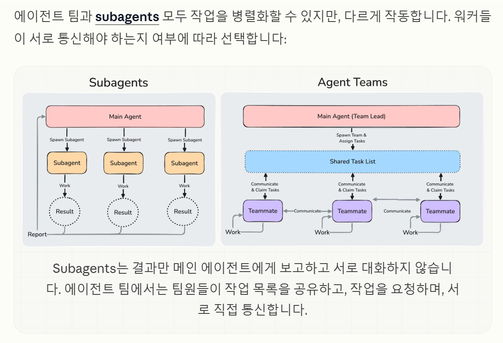
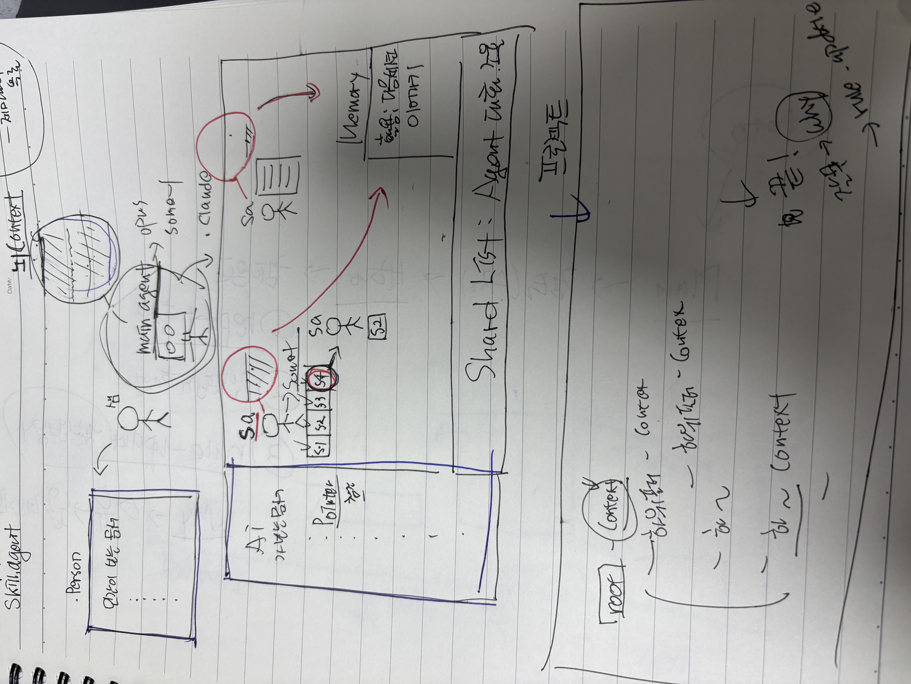
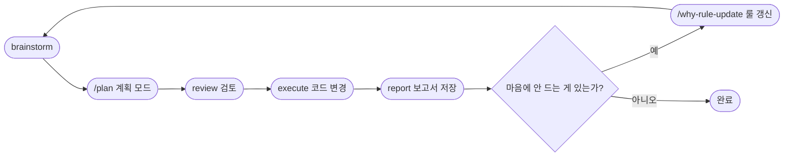

# AI-WORKFLOW 개발방법론

> AI와 함께 소프트웨어를 설계·개발하는 구조화된 워크플로우 가이드

---

## 리소스

| 항목 | 링크 |
|------|------|
| 제미나이 3개월 무료 사용법 | https://getinthere.notion.site/3-3228a08b6c0d80c7aa18f1c8e2466c24?source=copy_link |
| superpowers 플러그인 | https://github.com/obra/superpowers |
| 컴파운드 엔지니어링 철학 (참고) | https://news.hada.io/topic?id=26560 |

---

## AI 뇌 구조 분석




---

## 전체 흐름


---

## Part 1. 환경 구성

### 1. 프로젝트 기본 세팅
- 프로젝트 세팅 직접하기
- 하나의 도메인 구성 (예: User 도메인)
- 패키지 구조, 컨벤션, 코드 방식을 내가 자주 쓰는 구조로 변경

### 2. AI와 함께 구조 다듬기
- AI에게 원하는 구조로 변경시키면서 프로젝트 다듬기

### 3. AI를 위한 폴더 구성

```
.person/
├── docs/
├── reports/
└── logs/

.claude/
├── hooks/
├── rules/
├── skills/
└── reference/     ← skills의 상세 패턴 포인터
```

### 4. 스킬 장착

| 스킬 | 역할 |
|------|------|
| `/deepinit` | 프로젝트 구조 파악 |
| `/deep-interview` | 소크라테스 질문법으로 요구사항 명확화 |
| `/rule-update` | 새로운 룰 요약 갱신, 상세는 reference에 저장 |
| `/why-rule-update` | 버그·잘못된 수정의 원인 분석 + 규칙 갱신 통합 |

### 5. 에이전트 장착

> 현재는 사용할 agent가 없음. 필요 시 아래 구조 참고.


- agent는 컨텍스트를 따로 사용 → 병렬 실행 가능, 비용 절감
- skill은 model 선택 불가 / agent는 model 선택 가능
- **권장 구조**: agent가 skill을 호출하는 방향으로 설계

### 6. 룰 장착

```
.claude/rules/               ← 요약 정보만 (코드 블록 금지)
  ├── business-rules.md      ← 역할·권한·도메인 로직
  ├── code-rules.md          ← 코딩 컨벤션·파일 구조
  ├── design-system.md       ← UI 패턴·렌더링 방식
  └── general-rules.md       ← Claude 동작 메타 규칙
.claude/reference/           ← 상세 구현 패턴 (포인터로 연결)
```

> 모든 룰은 요약 정보만 담고, 상세 내용은 reference를 참조한다.
> 이유: 룰 파일이 통째로 컨텍스트에 로드되기 때문에 길면 오염됨.
> 이 규칙은 `CLAUDE.md`에 명시.

### 7. 훅(Hook) 장착

| 훅 | 역할 |
|-----|------|
| `skill-agent-log` | 실행된 agent/skill 기록 |
| `git-commit` | plan으로 코드 작성 시 자동 커밋 |
| `save-plan-report` | plan 종료 시 보고서 자동 생성 |

### 8. CLAUDE.md 생성
- 프로젝트 루트에 `CLAUDE.md` 작성
- rules/reference 분리 원칙, 워크플로우, 스킬 트리거 등 명시

---

## Part 2. AI 초기화

### 9. 동기화

> **여기부터 Opus로 작업** (설계 영역)

- AI에게 장착된 hook, skill, agent, rule을 읽고 동기화 요청
- 모든 스킬·훅·룰 장착 확인, CLAUDE.md 동기화

### 10. 재시작

- Claude 껐다가 다시 켜기
- CLAUDE.md + rule 자동 로드 확인
- skill은 name/description만 로드 → rule은 reference 포인터 세팅 필수

### 11. 프로젝트 초기화

```
/deepinit   → 프로젝트 구조 파악 및 AI-CONTEXT.md 생성
```

### 12. 룰 초기 업데이트

- `.person/docs`, `AI-CONTEXT.md`, `backend/` 폴더 확인 후 업데이트 요청
- `business-rules.md`, `code-rules.md`, `general-rules.md` 업데이트
- `design-system.md`는 디자인 완성 후 업데이트

---

## Part 3. 디자인

### 13. 플러그인 장착

| 플러그인 | 용도 |
|---------|------|
| superpowers | 개발 모든 단계 자동 관여 |
| frontend-design | 프론트 UI 생성 시 자동 발동 |
| playwright | 브라우저 자동화 (필요 시만 MCP 활성화) |
| context7 | 최신 문서 수집, 설계 단계에서 활용 |

### 14. UI 디자인 (stitch.withGoogle)

1. 원하는 화면 5장 디자인 완성 후 zip 다운로드
2. 압축 해제 → 화면별 폴더 정리 (`code.html`, `screen.png`)
3. 디자인 토큰 추출 → `design-system` rule 업데이트 요청 (룰 업데이트해 라고 하면 why-rule-update가 강제 발동함)
4. `templates/home.mustache` 등 원하는 형식으로 변환 요청
5. 프론트 완료

---

## Part 4. 개발 준비

### 15. 문서화 체크리스트

`.person/docs/` 폴더에 아래 문서 작성:

| 파일 | 내용 | 작성 방법 |
|------|------|---------|
| `prd.md` | 요구사항 정의서 | `/deep-interview` |
| `spec.md` | 기능 명세 | `/deep-interview` |
| `erd.md` | 테이블 설계 | `/deep-interview` |
| `tech-stack.md` | 기술 스택 | 직접 작성 |
| `phases.md` | 전체 개발 단계 | 직접 작성 |

루트 폴더:

| 파일 | 내용 |
|------|------|
| `tasks.md` | Phase별 상세 체크리스트 |
| `todo.md` | 오늘 할 일 |

---

## Part 5. 개발 워크플로우

### 16. 반복 개발 사이클



> 보고서는 `.person/reports/` 에 자동 저장
> 룰 갱신 이력은 `.claude/logs/` 에 기록

### 17. 세션 기억 저장

- 세션 종료 전 "지금 내용 기억해!" → `memory.md`에 영구 기록
- 다음 세션에서 자동으로 연결됨

---

## Part 6. 필수 스킬 목록

| 스킬 | 역할 |
|------|------|
| `deepinit` | 프로젝트 구조 문서화 |
| `deep-interview` | 요구사항 소크라테스식 명확화 |
| `why-rule-update` | 원인 분석 + 룰 갱신 통합 |
| `simplify` | 기능 변경 없이 가독성 중심 리팩토링 |
| `superpowers:code-reviewer` | 코드 리뷰 |
| `superpowers:writing-skills` | TDD 방식으로 새 스킬 작성 및 리팩토링 |
| `ui-redesign` | 기존 디자인 수정·추가 |
| `security-review` | 보안 검토 |
| `superpowers:test-driven-development` | 실패하는 테스트 먼저 작성 |
| `superpowers:systematic-debugging` | 에러 디버깅 |
| `superpowers:brainstorm` | 요구사항 명확화 (선택) |

---

## 부록. 권한 없이 실행

```bash
claude --dangerously-skip-permissions
```

```bash
# ~/.bashrc 에 alias 등록
nano ~/.bashrc
alias cc="claude --dangerously-skip-permissions"
source ~/.bashrc
```
